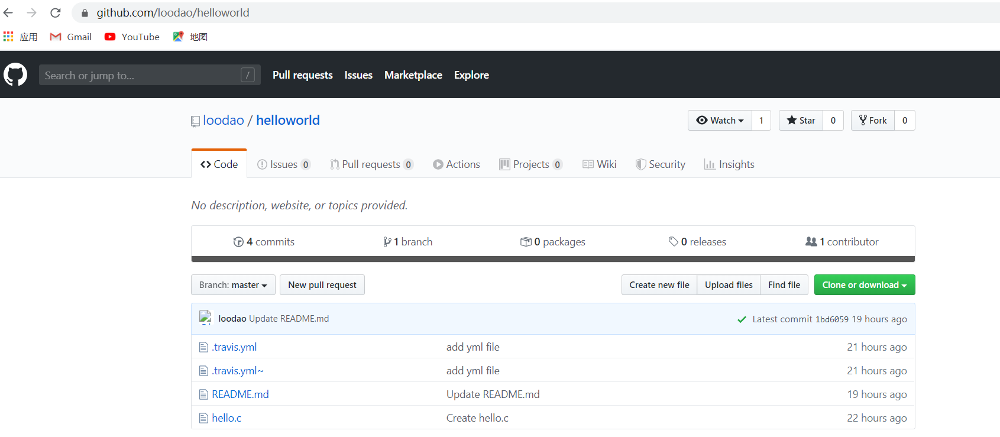
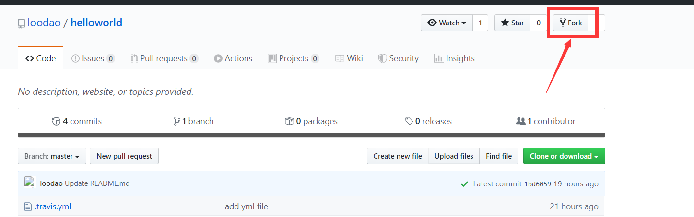
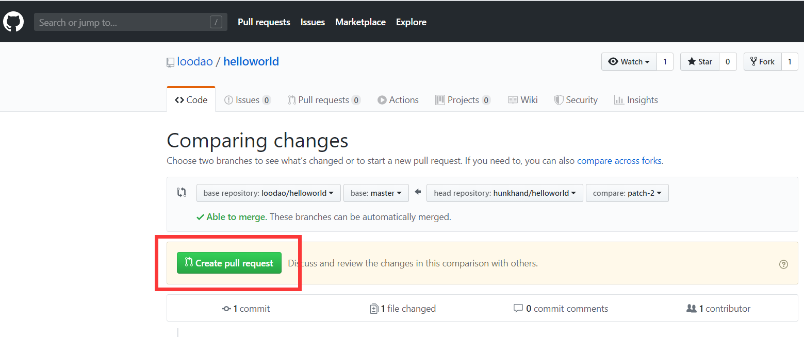

####                                                                                                                                  代码提交指引

​                               （对于git的操作可以在其官网下载中文版）

#####   步骤：  

#####      1： 注册github账号，链接： www.github.com   ;生成ssh密钥公码

#####      2:   打开作者（建库者）的项目https://github.com/loodao/helloworld.git

 

#####  3: 点击 fork （在自己的远程仓库复制一份项目代码）

   成功复制显示如下

##### 4：拷贝自己远程仓库的链接

##### 5：把项目代码克隆到本地仓库（硬盘）

​              打开终端，进到自己要存放项目的目录；并执行如下指令： git clone  +(刚才第四步的链接) ；例如我的

git clone https://github.com/hunkhand/helloworld.git (每个人的都不同) ；看下图

到此已经把项目代码从自己的远程仓库克隆下来；可以在本地编写或改写代码了；

####                            改写代码后如何提交到建库者进行审核及合并

#### 步骤如下

##### 1：编写或改写代码后添加到暂存区

    指令： 
    # git add . 是把所有的改动都添加到暂存区
    $git add .    (或git add 文件名)   

##### 2：提交更新日志

  ~~~
指令：
 # xxx是备注本次添加的说明
$git commit -m "XXXXXX"      
  ~~~

##### 3：查看本地状态

~~~
指令： 
$git status 
~~~

##### 4：接下来就是将修改的代码上转到自己的远程仓库中

~~~
指令：
$git push origin master
~~~

#### 5:将项目提交给作者（建库者） 

打开远程库----》点击项目上的pull request去请求greate pull request

到这步骤，提交代码任务完成； 作者（建库者）会收到请求合并的提示；经过代码审核流程，作者就可以合并代码到master

